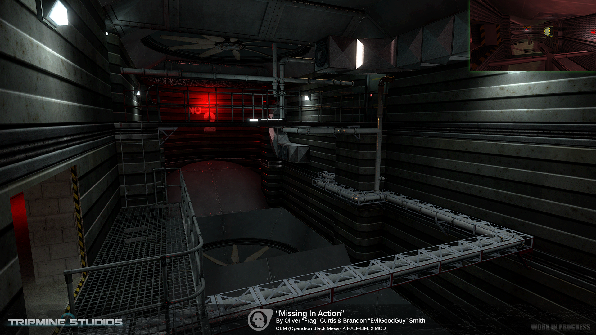
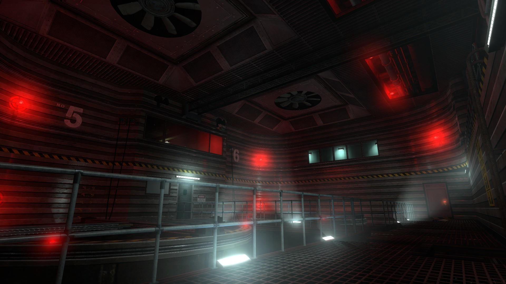
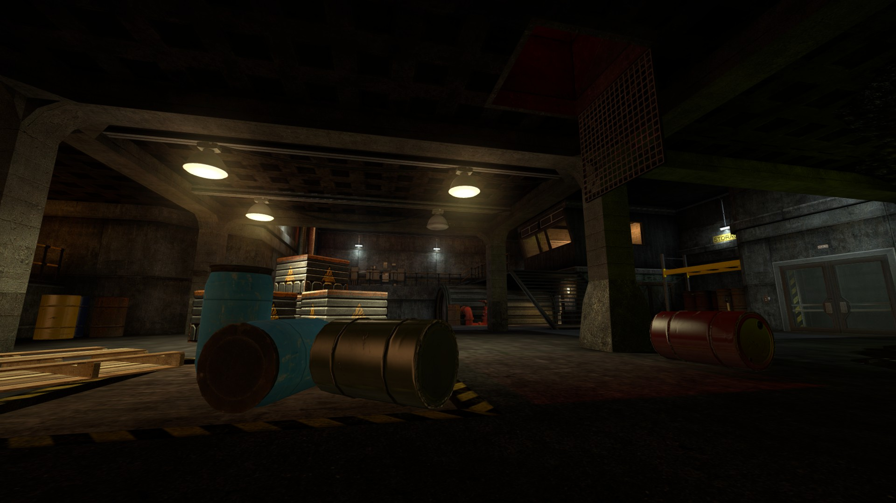
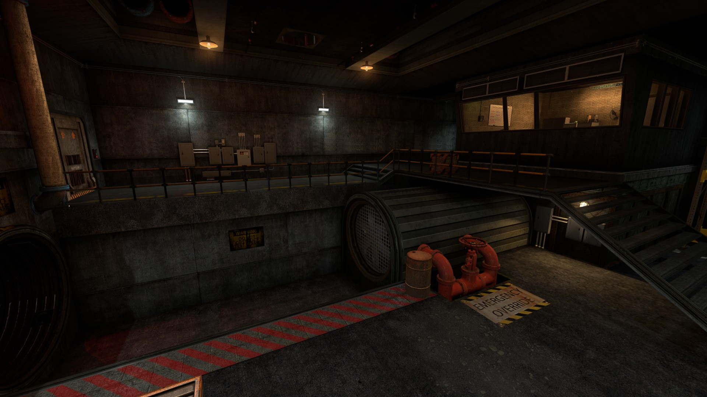
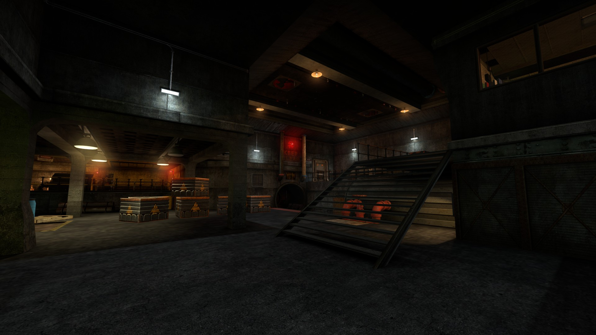
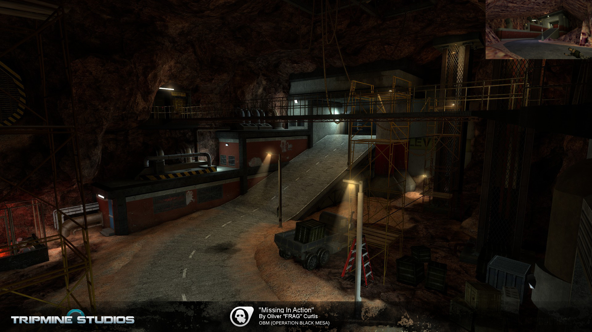

### Content

| Site         | Projects          | misc |
|:-------------|:------------------|:------|
| [Home](./index.md)           | [Operation:Black Mesa](./another-page.md) | [CV](./OliverCurtis.pdf)  |
| out of stock | good and plenty   | nice  |
| ok           | good `oreos`      | hmm   |
| ok           | good `zoute` drop | yumm  |

# Operation: Black Mesa

This is all of my work for the "Missing In Action" chapter for Operation Black Mesa.
My work involves:
Meeting up with other members of the team (monthly) to discuss assets needed, bugs and general feedback.
Constructing the level using the Hammer Editor.
Lighting, texture and asset placement inside my assigned levels.
Optimizing the level and testing it's playability.
Creating tickets using the teams Proofhub system, to request assets or report issues.

## OF2A1

## OF2A1B

## OF2A2

[back](./)
